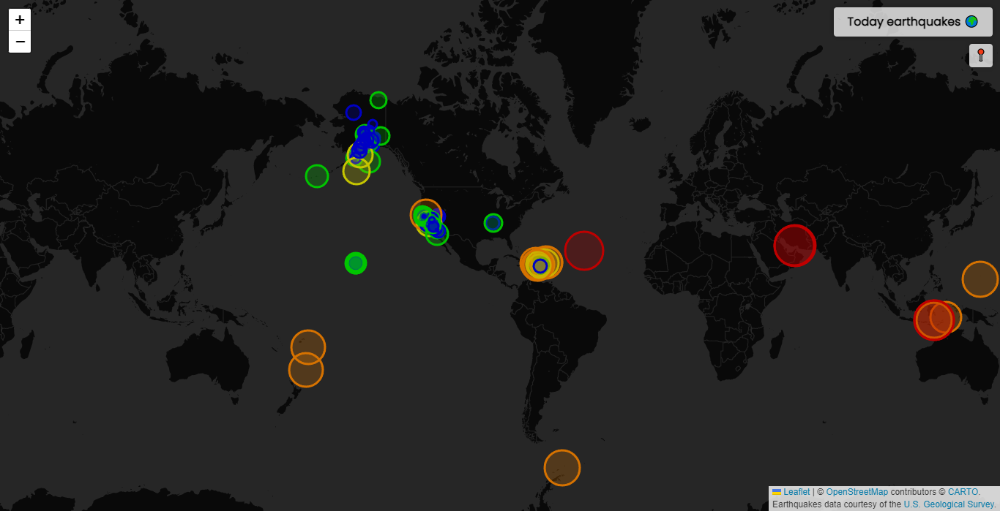

# Today earthquakes 🌍

Application to see the earthquakes of the day. It is made in TypeScript, SCSS and leaflet to implement the map. Earthquakes data courtesy of the [U.S. Geological Survey](https://earthquake.usgs.gov/).



## Prerequisites

Install the dependencies.

```bash
npm install
```

## Scripts

This creates a local server and rebuild it when you make changes.

```bash
npm run dev
```

This creates a production-ready version of the app and can be deployed to the web.

```bash
npm run build
```
